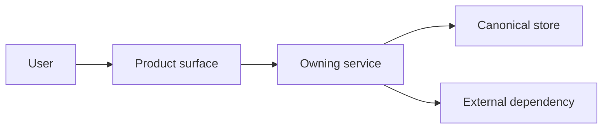

# SDD: [Capability or product decision]

Status: proposed | accepted | shipped
Version: YYYY-MM-DD
Owner: [person or team]
Related: [product, architecture and legal documents this depends on]

## Context

The user or business situation as it is today. Write observable evidence -
numbers, tickets, quotes, logs. Do not smuggle the solution you already prefer
into the problem statement.

## Outcome

What becomes possible for the user once this ships, in one sentence that can
be measured.

## Decision

The chosen behaviour and architecture, stated plainly and without hedging.

## User scenarios

### [Scenario name]

1. The user is in `[state]`.
2. The user does `[action]`.
3. The product responds with `[feedback]`.
4. The system stores or emits `[result]`.
5. On failure the user is left in `[recoverable state]`.

Repeat for each scenario that a reviewer would otherwise have to invent.

## Product contract

- Entry point:
- Primary action:
- Success state:
- Waiting state:
- Empty state:
- Recoverable failure:
- Terminal failure:
- Accessibility requirements:
- Mobile and responsive behaviour:

Every line is a state a user can reach. A blank line here becomes an
unspecified screen later.

## System boundary



For every arrow, name the owner, the input, the output, the timeout, the retry
behaviour and the privacy classification of what crosses it.

## State model

```text
initial
  -> in_progress
       -> done
       -> retryable_error -> in_progress
       -> fatal_error
```

Say which transitions are idempotent and which store is authoritative when two
of them disagree.

## Data and privacy

- Collected data:
- Purpose:
- Storage:
- Retention:
- Public fields:
- Sensitive fields:
- Deletion and export behaviour:

## Security

- Trust boundaries:
- Authentication and authorization:
- Values the server owns and the client may never set:
- Rate limits and abuse controls:
- Secret storage:
- Audit trail:

## Alternatives

| Alternative | Benefit | Cost | Why not selected |
| --- | --- | --- | --- |
| [A] | | | |
| [B] | | | |

## Rollout and rollback

- Feature flag:
- Migration:
- Compatibility with old clients and workers:
- Observability:
- Rollback trigger:
- Rollback procedure:

## Acceptance criteria

Numbered, observable, and checkable by someone who did not write this document.

1. [Observable user behaviour]
2. [Failure and recovery behaviour]
3. [Automated test]
4. [Accessibility or responsive check]
5. [Verification in production]

## Open questions

- [Question, owner, date the answer is needed]
